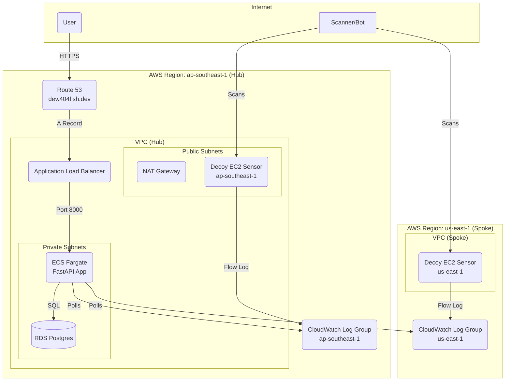

# 🏛️ Architecture Deep Dive

This document details the infrastructure architecture for the Internet Background Noise Visualizer, a multi-region threat intelligence platform.

### Table of Contents

  * [High-Level Diagram](#️-high-level-diagram)
  * [Component Breakdown](#-component-breakdown)
      * [1. The DNS Stack (infrastructure-dns/)](#1--the-dns-stack-infrastructure-dns)
      * [2. The Hub / Main Stack (infrastructure/)](#2--the-hub--main-stack-infrastructure)
      * [3. The Spoke / Sensor Stack (infrastructure-sensor-region/)](#3--the-spoke--sensor-stack-infrastructure-sensor-region)

-----

## 🗺️ High-Level Diagram (Hub and Spoke)

This diagram shows how the "Hub" (main application in `ap-southeast-1`) and the "Spokes" (remote sensors) interact.

-----

## 🧩 Component Breakdown

The infrastructure is broken into multiple, independent Terraform projects for security and maintainability.

### 1\. 🌐 The DNS Stack (`infrastructure-dns/`)

This is the **permanent, foundational stack**.

> **Purpose:** Manages the global resources that should never be destroyed.

  * **Region:** `ap-southeast-1` (or `us-east-1` for global certificates).
  * **Resources:**
      * `aws_route53_zone`: Creates the "control panel" (Hosted Zone) for `404fish.dev`.
      * `aws_acm_certificate`: Provisions a free, auto-renewing SSL certificate for `*.404fish.dev`.

-----

### 2\. 🏠 The Hub / Main Stack (`infrastructure/`)

This is the **ephemeral application stack**, managed with `dev` and `prod` workspaces.

> **Purpose:** Deploys the main application and its local sensor.

  * **Region:** `ap-southeast-1` (dev/prod).
  * **Key Modules:**
      * `networking`: Builds the VPC, public/private subnets, NAT Gateway, and the IAM role for Flow Logs.
      * `security`: Manages all Security Groups (for the ALB, ECS, and RDS) to enforce strict, zero-trust networking.
      * `data`: Provisions the RDS PostgreSQL database (in private subnets) and the AWS Secrets Manager secret for its password.
      * `compute`: Provisions the ALB (with HTTPS redirect), the ECS Cluster, the ECS Task Definition (which injects all secrets as environment variables), and the ECS Service that runs the app.
      * `cicd_iam`: Provisions the IAM Role and Policy for the GitLab CI/CD pipeline, using OIDC for secure, keyless authentication.
      * `decoy_sensor`: Deploys the local EC2 decoy sensor in the public subnet.
  * **DNS Handling:**
      * This stack creates the final `A` record (e.g., `dev.404fish.dev`) to point to the ALB. When you run `terraform destroy`, only this A record is deleted, not the whole domain.

-----

### 3\. 📡 The Spoke / Sensor Stack (`infrastructure-sensor-region/`)

This is an **ephemeral, re-usable template** for deploying new sensors.

> **Purpose:** To deploy a lightweight, cheap decoy sensor in any AWS region.

  * **Region:** Any region (e.g., `us-east-1`, `eu-west-1`).
  * **Resources:**
      * `networking`: Builds a new VPC, subnets, and a CloudWatch Log Group.
      * `decoy_sensor`: Deploys the EC2 decoy sensor in that region.

> **Key Interaction:** The central application polls the CloudWatch Log Groups from all "Spoke" stacks to create its global dataset.
