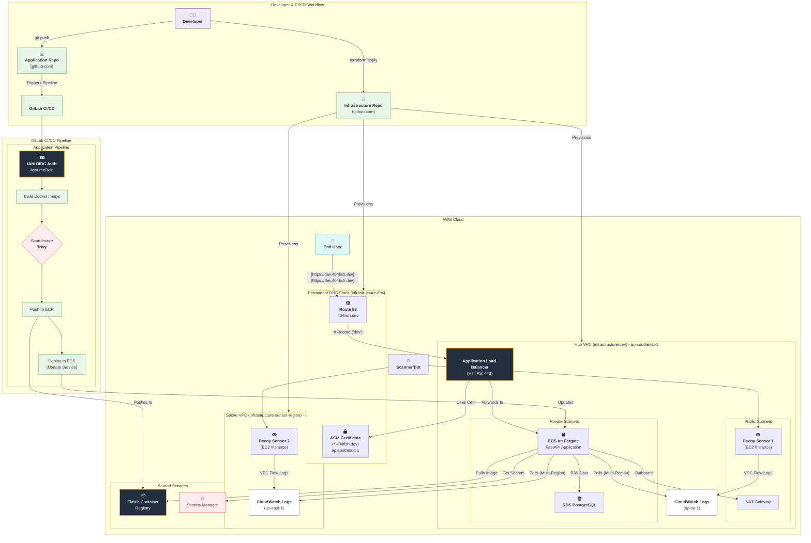

 [](https://gitlab.com/aws-homelab1/internet-noise-visualizer/-/commits/main)


# 🌐 Internet Background Noise Visualizer (Infrastructure)

> This repository contains all the Infrastructure as Code (IaC) for a multi-region, high-availability threat intelligence dashboard. This project is a comprehensive demonstration of end-to-end cloud engineering, security, and DevSecOps principles.

The application code that runs on this infrastructure is in a separate repository:
[https://github.com/AdithyaaSivamal/404fish]

-----

### Table of Contents

  * [Architecture Overview](#-architecture-overview)
  * [Core Technologies](#-core-technologies)
  * [Repository Structure](#-repository-structure)
  * [Deployment Guide](#-deployment-guide)
  * [Documentation](#-documentation)

-----

## 🏛️ Architecture Overview

This project uses a **"Hub and Spoke"** architecture to collect and process data.

  * **Hub (Main App Stack):** A primary AWS region (`ap-southeast-1`) that hosts the core application. This includes the ALB, the ECS Fargate cluster (running the FastAPI app), and the central RDS PostgreSQL database.
  * **Spokes (Sensor Stacks):** Lightweight, independent stacks in other AWS regions (e.g., `us-east-1`). Each spoke deploys a "decoy sensor" (a firewalled EC2 instance) and a VPC Flow Log, which feeds data back to the central hub application.

This multi-region design provides a more accurate, less-biased view of global internet scanner traffic.




-----

## 💻 Core Technologies

This project is built entirely with **Terraform** and **AWS**.

| Category | Technologies Used |
| :--- | :--- |
| **IaC** | Terraform (Workspaces, Modules) |
| **Cloud Provider** | Amazon Web Services (AWS) |
| **Compute** | ECS on Fargate, EC2 (for decoy sensors) |
| **Database** | RDS PostgreSQL |
| **Networking** | VPC, Public/Private Subnets, NAT Gateway, Security Groups, Route 53 |
| **Security** | IAM (Roles, Policies), ACM (SSL Certificates), Secrets Manager |
| **Logging** | CloudWatch (for Flow Logs), CloudTrail (for auditing) |

-----

## 📁 Repository Structure

This repository contains multiple, independent Terraform projects:

  * `infrastructure-dns/`
      * **Permanent Stack.** Manages the Route 53 Hosted Zone and the global ACM SSL Certificate. Run this once and then leave it alone.
  * `infrastructure-sensor-region/`
      * **Ephemeral Spoke.** A template for deploying new decoy sensors in remote regions.
  * `infrastructure/`
      * **Ephemeral Hub.** The main application stack, managed with Terraform Workspaces.

-----

## 🚀 Deployment Guide

The main `infrastructure/` directory uses Terraform Workspaces to manage `dev` and `prod` environments.

### To Deploy the `dev` Environment:

```bash
# 1. Navigate to the main infrastructure directory
cd infrastructure/

# 2. Initialize Terraform
terraform init

# 3. Select the 'dev' workspace (or create it)
terraform workspace select dev
# (if it doesn't exist, run: terraform workspace new dev)

# 4. Plan the deployment
terraform plan -var-file="dev.tfvars"

# 5. Apply the deployment
terraform apply -var-file="dev.tfvars"
```

### To Destroy the `dev` Environment:

```bash
cd infrastructure/
terraform workspace select dev
terraform destroy -var-file="dev.tfvars"
```

-----

## 📚 Documentation

For a complete breakdown of the architecture, security controls, and deployment strategy, see the detailed documentation:

  * **[Architecture Deep Dive](/docs/architecture_deepdive.md)**
  * **[CI/CD Pipeline Breakdown (Coming Soon)]()**
  * **[Security & Best Practices (Coming Soon)]()**
